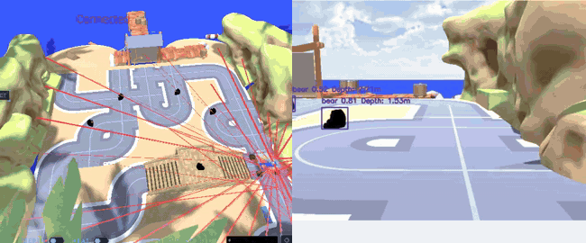
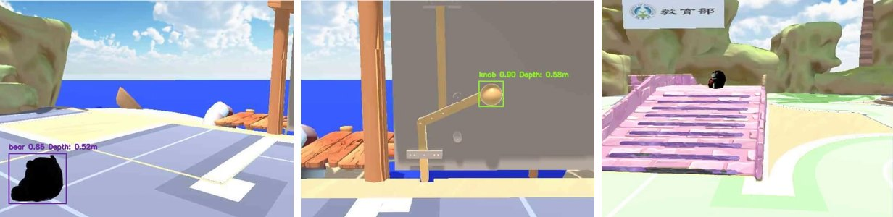
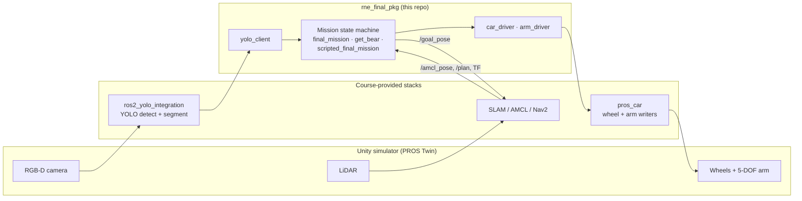

# Autonomous Pick-and-Place Rover — ROS 2 Mission Stack


A ROS 2 package that drives a four-wheel rover with a 5-DOF arm through a randomized Unity course on its own: it finds stuffed bears with YOLO, localizes them in the map frame, drives over and grabs them, crosses a ramp/bridge, and opens a door. The package contains three complete mission state machines, including one that does not use Nav2 at all.

Final project for **Robotic Navigation and Exploration** at National Tsing Hua University (Spring 2026). Package author: Hsiang-Yu (Rich) Kung.

<p align="center">
  
  <br><sub>Left: the Unity course from above. Right: the rover's camera with my detector running (bear / knob, with depth). Recorded while driving manually to validate perception, sped up 4×.</sub>
</p>

## Highlights

- **Three mission controllers, one package.** A Nav2-based 3-task mission, a looping multi-bear retrieval node, and a **Nav2-free scripted mission** that routes purely on the `map → base_footprint` TF pose.
- **Pixel → map localization.** YOLO detections are backprojected through the depth camera intrinsics and TF into the map frame, then the last metre is closed with a pixel-offset visual servo.
- **Custom perception.** Detector and segmenter trained on 189 images I collected from the rover's camera and labelled in Roboflow (detection test mAP50 0.95).
- **Failure handling, not just the happy path.** Four-tier stuck recovery, depth-based grasp verification with bounded retries, and a blocking-bear classifier that clears an obstacle bear before attempting the ramp.

## Perception

<p align="center">
  
</p>

The mission nodes run on perception models I trained:

| Model | Classes | Training data | Test result |
|-------|---------|---------------|-------------|
| YOLO11s detection | `bear`, `knob` | 189 images (130 / 39 / 20 split) | mAP50 0.947, mAP50-95 0.619 |
| YOLO11m-seg segmentation | `road`, `bridge` | 189 images (132 / 38 / 19 split) | mask mAP50 0.869 |
| YOLO11n-seg (`ramp_yolo11n.pt`) | `ramp` | trained later for the ramp search in the scripted mission | not recorded |

Images came from the rover's own camera in the final-project scene, collected at different distances, angles and occlusion levels, including empty frames as hard negatives. Each detection is paired with the depth at its centre, which is what `get_bear` backprojects into the map frame.

## System overview



Everything outside `rne_final_pkg` (the simulator, YOLO container, SLAM/Nav2 bring-up and low-level drivers) was provided by the course. This repository is the decision-making layer on top.

## Mission controllers

| Node | Navigation | What it does | Docs |
|------|-----------|--------------|------|
| `final_mission` | Nav2 | Linear 3-task run: find and grab a bear, align to and cross the bridge, reach and unlock the Task 3 target, then clear the area. | [docs/final_mission.md](docs/final_mission.md) |
| `get_bear` | Nav2 | Looping retrieval of *N* bears: search, backproject, navigate, servo, grab, verify, return home, drop, repeat. | [docs/get_bear.md](docs/get_bear.md) |
| `scripted_final_mission` | **None (TF pose only)** | Opens the door (knob servo + arm press), then searches the ramp from two sides, classifies and clears a blocking bear, grabs the ramp bear and returns, with an optional cleanup patrol. | [docs/scripted_final_mission.md](docs/scripted_final_mission.md) |

### How the Nav2-free variant works

The scripted mission replaces the planner with a short list of map-frame waypoints (`config/scripted_mission.yaml`) and two closed-loop primitives, `turn_to_yaw` and `drive_to_point`, that check progress against the TF pose (falling back to `/amcl_pose`). Every motion therefore has a measurable completion condition plus a monotonic-clock timeout, instead of a blind `sleep()`.

## Key techniques

<details>
<summary><b>Target localization by backprojection</b></summary>

`get_bear` reads the bear's pixel centre and depth from `/yolo/bear_info`, backprojects it with the pinhole model from `/camera/depth/camera_info`, and transforms the 3-D point from the camera frame to `map` through TF. Nav2 then gets a goal `bear_stop_distance_m` in front of the bear, and a visual servo on the horizontal pixel offset takes over for the final approach.
</details>

<details>
<summary><b>Grasp verification with bounded retries</b></summary>

After the arm closes, the rover backs up slightly and counts frames in which the bear's depth is below `verify_arm_depth_threshold` (i.e. it is riding on the arm). Enough close frames confirm the grasp; otherwise it retries up to `grab_retry_max` times before skipping that bear.
</details>

<details>
<summary><b>Four-tier stuck recovery</b></summary>

Every linear drive command arms a stuck check. If the map-frame position does not change by `stuck_move_threshold` within `stuck_timeout`, the node escalates through back-up → back-left → back-right → aggressive back-left, then resumes the state that triggered it. Successful motion steps the recovery level back down.
</details>

<details>
<summary><b>Shape-based ramp alignment</b></summary>

A monocular mask's centreline shift mixes lateral offset and yaw. `bridge_align` first centres the mask centroid (removing the lateral term), then treats the remaining centreline skew as a yaw proxy and de-yaws in place, and only then creeps forward with hysteresis back to the earlier phases.
</details>

## Results and lessons

- **Residual grasp failures were traced to visual-servo latency** under GPU-limited YOLO inference: the detection stream lagged the robot's motion during the final approach. Grasp verification and bounded retries make these failures recoverable rather than mission-ending.
- **Next step:** a latency-aware servo, e.g. lower gain near the stop distance or compensating with the robot's last commanded velocity.

## Repository layout

```
rne_final_pkg/
├── rne_final_pkg/
│   ├── final_mission.py            # Nav2 3-task mission
│   ├── get_bear_node.py            # Nav2 multi-bear retrieval
│   ├── scripted_final_mission.py   # Nav2-free scripted mission
│   ├── ramp_bear.py, ramp_bear_12.py, door_test.py   # sub-sequence rehearsal nodes
│   ├── bridge_align.py, bridge_avoid.py              # ramp/bridge behaviours
│   ├── final_mapping_manager.py, rectangle_mapping.py, wall_follow_mapping.py  # map building
│   ├── yolo_client.py, nav_client.py                 # perception / navigation clients
│   ├── car_driver.py, arm_driver.py                  # actuator wrappers
│   └── topic_check.py, yolo_align.py                 # diagnostics
└── config/                         # per-node YAML parameters
docs/                               # per-node reference (topics, states, parameters)
```

## Build and run

Requires ROS 2 Humble and the course's `pros_car`, `ros2_yolo_integration` and SLAM/Nav2 containers running alongside the Unity simulator.

```bash
# inside the pros_car Docker container
colcon build --packages-select rne_final_pkg && source install/setup.bash

ros2 run rne_final_pkg topic_check              # pre-flight: missing topics / TF frames
ros2 run rne_final_pkg scripted_final_mission   # Nav2-free mission
ros2 run rne_final_pkg get_bear                 # multi-bear retrieval (needs Nav2)
ros2 run rne_final_pkg final_mission            # 3-task mission (needs Nav2)
```

Map-building helpers: `build_map` (records the origin into `goals.yaml`) and `rect_map` (open-loop rectangle drive for SLAM).

## License

MIT, as declared in [`package.xml`](rne_final_pkg/package.xml). See [LICENSE](LICENSE).
