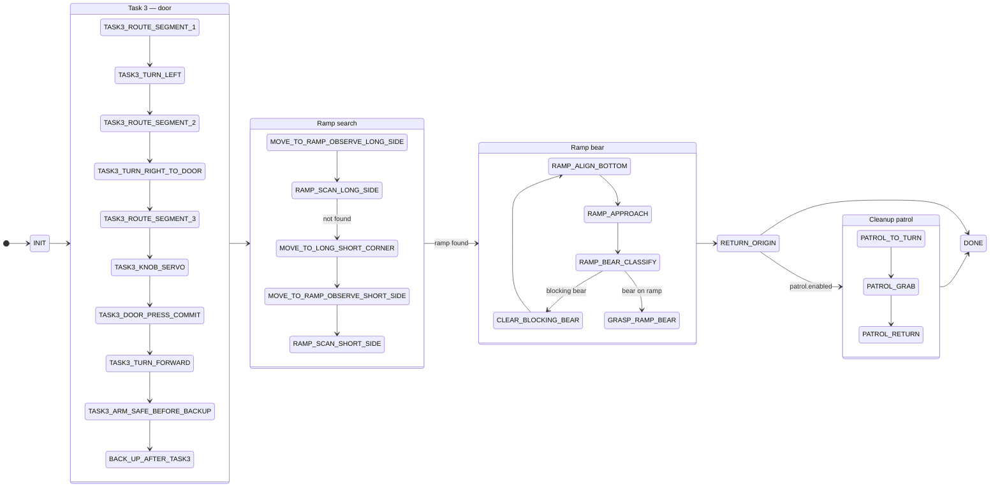

# `scripted_final_mission` — Nav2-free mission

> Reference doc for `scripted_final_mission.py`. See the [top-level README](../README.md) for the project overview.

This node runs the full course without Nav2. Instead of handing goals to a planner, it drives a scripted route of map-frame waypoints and closes the loop on its own pose estimate:

- **Pose feedback:** TF `map → base_footprint` (preferred), `/amcl_pose` as fallback.
- **Route progress and turns** are checked against map-frame `x, y, yaw`, never against bare `sleep()` timers.
- **Phase timing** uses `time.monotonic()` so a stalled simulator does not corrupt timeouts.

All tunables (route points, servo gains, thresholds, patrol toggle) live in [`config/scripted_mission.yaml`](../rne_final_pkg/config/scripted_mission.yaml), grouped as `init`, `route`, `control`, `stuck`, `safety`, `knob_servo`, `door_press`, `ramp`, `bear`, `return`, `patrol`.

## Run

```bash
ros2 run rne_final_pkg scripted_final_mission
```

## Perception inputs

| Topic | Source | Used for |
|-------|--------|----------|
| `/yolo/knob_info` | YOLO detection | Door-knob visual servo (Task 3) |
| `/yolo/bear_info` | YOLO detection + depth | Bear classification and grasp |
| `/yolo/bridge_info` | YOLO11n segmentation (`ramp` class) | Ramp search and alignment (legacy topic name) |
| `/camera/depth/camera_info` | camera | Intrinsics for pixel → 3-D backprojection |

## State flow



## Notable behaviors

| Behavior | What it does |
|----------|--------------|
| **Two-sided ramp scan** | Observes the ramp from the long side first, then walks the perimeter corner (avoiding a diagonal over the bridge) to a short-side observe chain if the long side fails. |
| **Ramp bottom alignment** | Servos so the near edge of the ramp segmentation mask reaches the bottom of the frame before committing to the climb. |
| **Bear classification** | Samples several frames and votes whether the visible bear sits *on* the ramp or *blocks* it. A blocking bear is grabbed and moved out of the way first, then alignment restarts because the car has moved. If a bear vanishes at close range (inside the depth camera's blind zone), the node grasps from a cached close-range snapshot instead of backing off and looping. |
| **Knob servo + door press** | Centres on the knob detection, then commits to an open-loop arm sequence: raise, advance, swing down through the handle to unlock, hold it pressed (the rod lock re-engages if released) and arc-push along the door's swing. Calibrate it alone with `ros2 run rne_final_pkg door_test`. |
| **Cleanup patrol** | After the ramp bear is delivered, optionally drives back toward the turn point to grab a remaining ground bear and return it. |

## Variants

`ramp_bear` and `ramp_bear_12` subclass `ScriptedFinalMission` and reuse its handlers to rehearse sub-sequences (ramp-only run; ramp run starting from the third short-side observe point). `door_test` isolates the Task 3 knob/door sequence.
